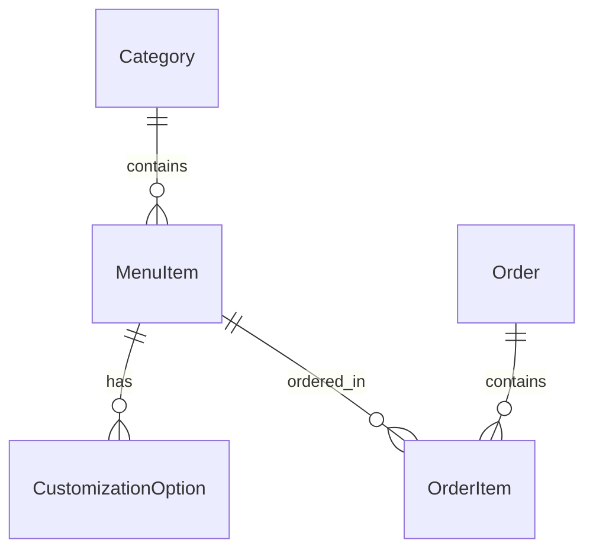

# وثيقة تصميم موقع المطعم المتكامل (Restaurant Platform Design Specification)

تصف هذه الوثيقة البنية التقنية والتصميمية لبناء موقع مطعم متكامل واحترافي مستوحى من تجربة المستخدم لمطاعم KFC و Burger King.

## 1. نظرة عامة على المشروع (Project Overview)
المشروع عبارة عن تطبيق ويب متكامل لطلب الوجبات السريعة وتخصيصها وتتبع الطلبات.
*   **الواجهة الأمامية (Frontend):** React (Vite) + TypeScript + Tailwind CSS v4.
*   **الخلفية البرمجية (Backend):** Node.js + Express + TypeScript.
*   **قاعدة البيانات (Database):** SQLite عبر Prisma ORM.
*   **الأهداف الأساسية:** سرعة التصفح، تجربة مستخدم بديهية، إتمام الطلبات بسلاسة، وتتبع مباشر للطلبات.

---

## 2. بنية تجربة المستخدم والواجهات (UX/UI Architecture)

### الصفحات والمكونات الأساسية:
1.  **الصفحة الرئيسية (Home Page):**
    *   عارض الوجبات الرئيسية (Hero Banner) مع أزرار طلب مباشر.
    *   شريط إعلاني متحرك (Promo Marquee).
    *   شبكة العروض الحصرية (Special Offers Grid).
2.  **صفحة قائمة الطعام (Menu Page):**
    *   قائمة تصنيفات جانبية مرنة (Sidebar Category Nav).
    *   قائمة وجبات تفاعلية (Interactive Menu Grid).
    *   نافذة التخصيص (Customization Modal): اختيار الأحجام، الإضافات (الجبن، الصوصات)، وحذف المكونات.
3.  **سلة التسوق الجانبية (Cart Drawer):**
    *   سلة منزلقة من الجانب لعرض تفاصيل الوجبات والأسعار وتعديل الكميات دون مغادرة الصفحة.
4.  **صفحة الدفع وإتمام الطلب (Checkout Page):**
    *   نموذج اختيار نوع الاستلام: توصيل (Delivery) أو استلام من الفرع (Pickup).
    *   تفاصيل العنوان، رقم الهاتف، والاسم.
    *   ملخص الحساب التفصيلي (المنتجات + التوصيل + الضرائب).
5.  **صفحة تتبع الطلب (Order Tracking Page):**
    *   شاشة تفاعلية حية تعرض الخط الزمني لحالة الطلب.

---

## 3. بنية البيانات وقاعدة البيانات (Database Schema)

تستخدم قاعدة بيانات **SQLite** محلية مخزنة كملف مدمج داخل الباك إند، وتتم إدارتها بواسطة **Prisma ORM**.

### الجداول والحقول بالتفصيل:

#### 1. جدول التصنيفات (`Category`)
| الحقل | النوع | الوصف |
| :--- | :--- | :--- |
| `id` | String (UUID) | المعرف الفريد للتصنيف |
| `name` | String | اسم التصنيف (مثال: برجر، وجبات عائلية) |
| `slug` | String | المعرف النصي للروابط (مثال: burgers) |
| `image` | String | رابط صورة التصنيف |

#### 2. جدول المنتجات (`MenuItem`)
| الحقل | النوع | الوصف |
| :--- | :--- | :--- |
| `id` | String (UUID) | المعرف الفريد للوجبة |
| `name` | String | اسم الوجبة |
| `description`| String | وصف المكونات |
| `price` | Float | السعر الأساسي للوجبة |
| `calories` | Int | السعرات الحرارية |
| `image` | String | رابط صورة الوجبة |
| `categoryId` | String | المعرف الخاص بالتصنيف المرتبط |
| `isAvailable`| Boolean | توفر المنتج في المنيو |

#### 3. جدول خيارات التخصيص (`CustomizationOption`)
| الحقل | النوع | الوصف |
| :--- | :--- | :--- |
| `id` | String (UUID) | المعرف الفريد للخيار |
| `menuItemId` | String | الوجبة المرتبطة بالخيار |
| `name` | String | اسم الإضافة (مثال: جبنة إضافية، وسط، كبير) |
| `price` | Float | تكلفة الخيار الإضافية |
| `category` | String | نوع الإضافة (SIZE, ADDON, EXCLUDE) |

#### 4. جدول الطلبات (`Order`)
| الحقل | النوع | الوصف |
| :--- | :--- | :--- |
| `id` | String (UUID) | كود الطلب الفريد للزبون |
| `customerName`| String | اسم العميل |
| `customerPhone`| String | رقم هاتف العميل |
| `deliveryType`| String | نوع الطلب (DELIVERY أو PICKUP) |
| `address` | String? | عنوان العميل للتوصيل |
| `status` | String | حالة الطلب (PENDING, PREPARING, SHIPPED, COMPLETED) |
| `totalPrice` | Float | المجموع الكلي للطلب بالضرائب والتوصيل |
| `createdAt` | DateTime | تاريخ ووقت إنشاء الطلب |

#### 5. جدول تفاصيل عناصر الطلب (`OrderItem`)
| الحقل | النوع | الوصف |
| :--- | :--- | :--- |
| `id` | String (UUID) | المعرف الفريد للعنصر |
| `orderId` | String | معرف الطلب الرئيسي المرتبط |
| `menuItemId` | String | معرف الوجبة المطلوبة |
| `quantity` | Int | الكمية المطلوبة |
| `price` | Float | سعر الوجبة عند الطلب |
| `customizations`| String (JSON) | تفاصيل الإضافات والتعديلات المختارة للوجبة |

---

## 4. المسارات وواجهة البرمجة (API Routes)

يتم تشغيل الخادم على المنفذ `3001` ويقوم بخدمة المسارات التالية:

### قائمة الطعام والتصنيفات:
*   `GET /api/categories` -> الحصول على تصنيفات المنيو مع صورها.
*   `GET /api/menu` -> الحصول على المنيو كاملاً مع الوجبات وخيارات التخصيص.

### الطلبات والتتبع:
*   `POST /api/orders` -> إنشاء طلب جديد وتخزينه.
*   `GET /api/orders/:id` -> تتبع حالة الطلب في الوقت الحقيقي.
*   `PATCH /api/orders/:id/status` -> (تحديث الحالة) لتغيير حالة الطلب من قبل نظام الإدارة (التحضير، الشحن، الاكتمال).

---

## 5. خطة التحقق والاختبار (Verification Plan)
*   **الفحص الذاتي للواجهات:** التأكد من استجابة واجهة المستخدم على الجوال والحاسوب المحمول.
*   **اختبار تدفق الطلب بالكامل:** إضافة وجبات للسلة ➔ تخصيصها ➔ إدخال معلومات التوصيل ➔ إتمام الطلب ➔ تتبع حالته للتأكد من ربط الباك إند والفرونت إند بنجاح.
*   **صحة تخزين البيانات:** مراجعة قاعدة بيانات SQLite للتأكد من صحة تخزين حقول الطلبات والوجبات.
